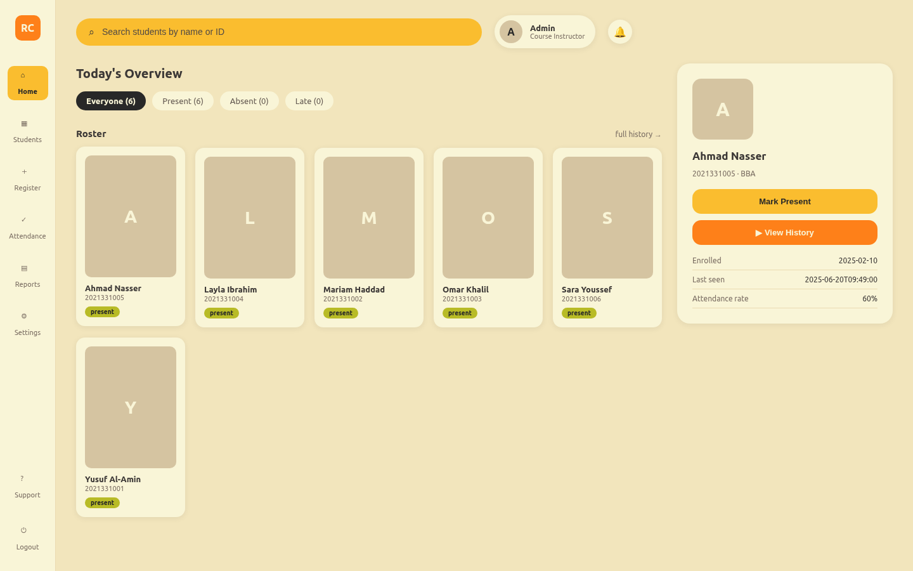
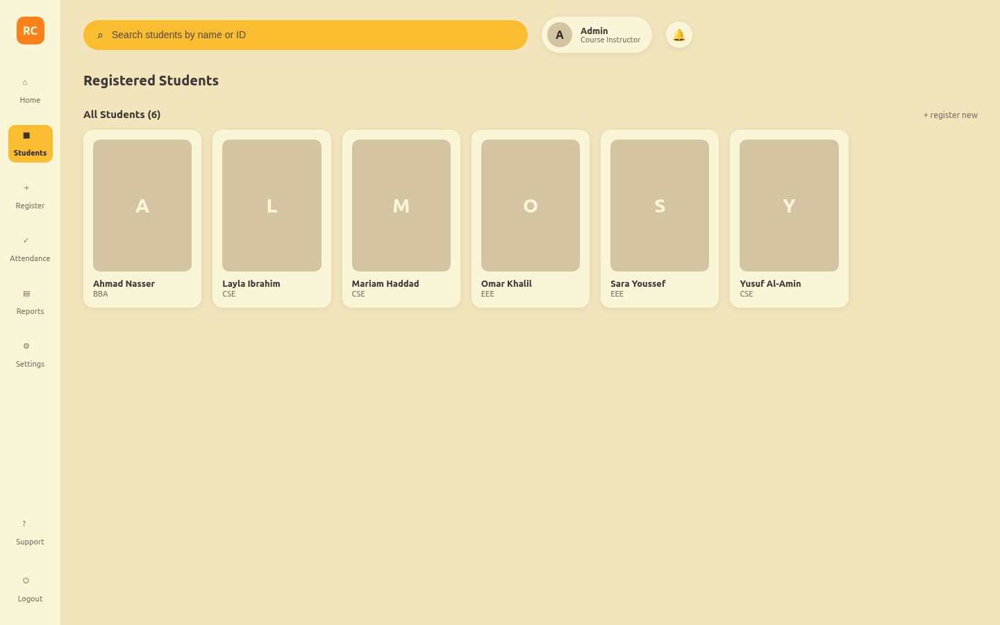
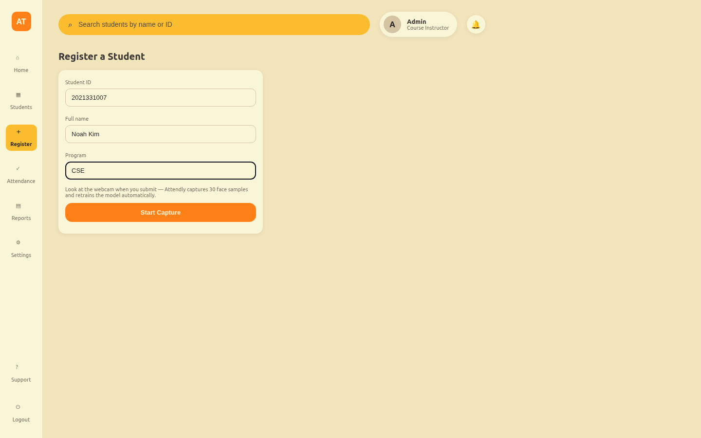
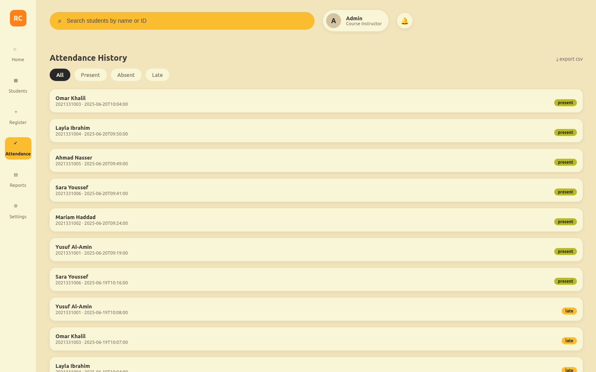
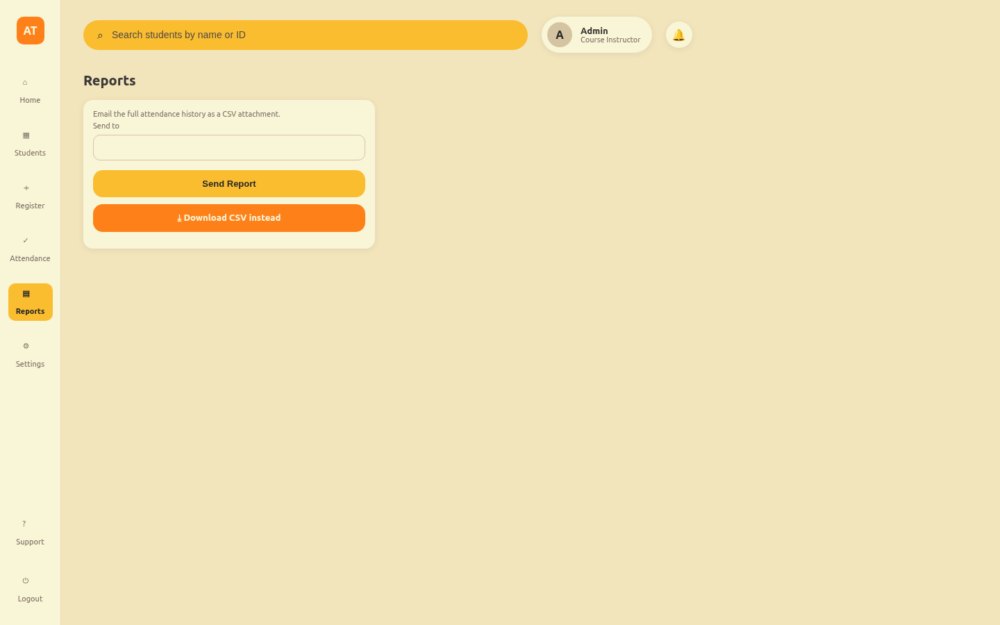
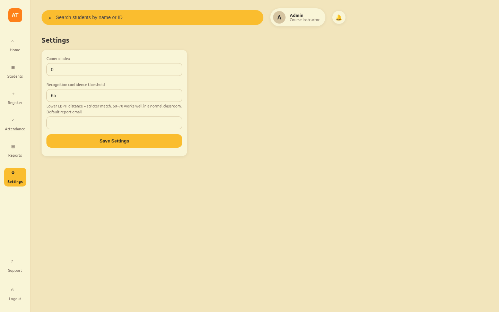

<div align="center">

# RollCall

**Attendance that takes itself.**

Point a webcam at the door. RollCall recognizes every face that walks
through it, logs the timestamp, and keeps the roster up to date —
no sign-in sheets, no spreadsheets, no "did you actually show up" arguments.

[](https://www.python.org/)
[](https://flask.palletsprojects.com/)
[](https://opencv.org/)
[](https://www.sqlite.org/)
[](https://developer.mozilla.org/docs/Web/JavaScript)
[](https://developer.mozilla.org/docs/Web/HTML)
[](https://developer.mozilla.org/docs/Web/CSS)
[](https://git-scm.com/)

</div>

## Why RollCall

Manual attendance wastes the first five minutes of every class and is
trivially easy to fake for a friend. RollCall replaces it with a face
recognition pipeline you fully own — your data never leaves your machine,
there's no per-seat SaaS fee, and the whole thing is ~1,000 lines of
readable Python you can actually audit.

- **Set up once.** Register a student in under a minute — RollCall captures
  30 face samples and retrains the recognizer automatically.
- **Own your data.** SQLite on disk. No cloud account, no vendor lock-in.
- **See the whole picture.** A live dashboard shows who's present, who's
  late, and who's missing — click anyone for their full attendance history.
- **Reports without the busywork.** Export CSV or have the day's report
  emailed to you automatically.

## Screenshots

<table>
<tr>
<td width="50%">

**Dashboard**


</td>
<td width="50%">

**Students**


</td>
</tr>
<tr>
<td width="50%">

**Register**


</td>
<td width="50%">

**Attendance history**


</td>
</tr>
<tr>
<td width="50%">

**Reports**


</td>
<td width="50%">

**Settings**


</td>
</tr>
</table>

## Built with


| Layer | Choice | Why |
|---|---|---|
| Detection & recognition | OpenCV Haar cascade + LBPH | Fast, dependency-light, runs on a laptop CPU |
| Backend | Flask + SQLite | No ORM ceremony, one file database, zero infra |
| Frontend | Jinja templates + vanilla JS | No build step — clone and run |
| Styling | Hand-rolled Gruvbox palette | Warm, high-contrast, easy on the eyes for a screen you'll stare at all day |
| Reports | CSV export + SMTP | Get numbers out without opening the database |

## Install it

```bash
git clone https://github.com/bepunpun/rollcall.git
cd rollcall

python -m venv .venv
source .venv/bin/activate          # .venv\Scripts\activate on Windows
pip install -r requirements.txt

# optional: populate the dashboard with fake students/attendance
python scripts/seed_demo_data.py

python app.py                      # → http://127.0.0.1:5000
```

That's it — no database server, no API keys, no build tooling.

To register a real student: open **Register**, enter their ID and name,
and look at the webcam when you submit. RollCall captures face samples,
retrains the model, and the student shows up on the dashboard immediately.

### Email reports (optional)

```bash
export ROLLCALL_SMTP_USER=you@gmail.com
export ROLLCALL_SMTP_PASSWORD=your-app-password
export ROLLCALL_REPORT_EMAIL=default-recipient@example.com
```

## Project layout

```
app.py                 Flask routes
config.py               paths, camera index, thresholds
core/
  database.py            SQLite schema + queries
  detector.py             Haar cascade wrapper
  capture.py               registration capture flow
  trainer.py                LBPH training
  recognizer.py              recognition + attendance marking
  mailer.py                   SMTP report delivery
  settings_store.py            runtime-editable settings
scripts/
  check_camera.py         webcam sanity check
  seed_demo_data.py       fake data for demoing the UI
templates/, static/     the gruvbox dashboard UI
```

## License

MIT — see [LICENSE](LICENSE).
